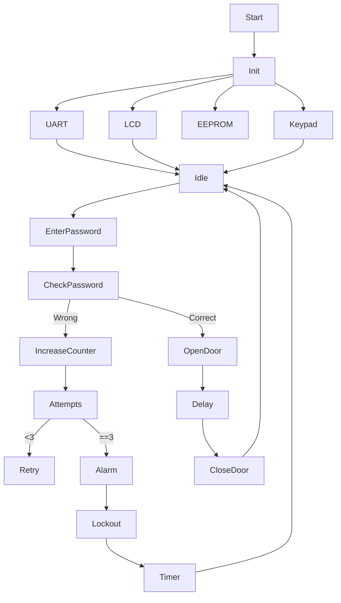
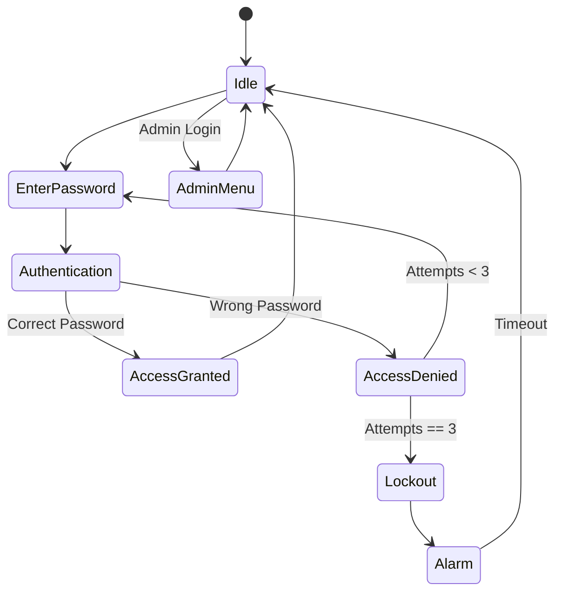
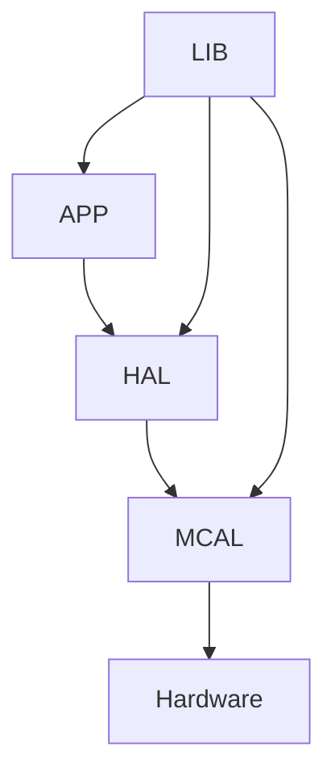
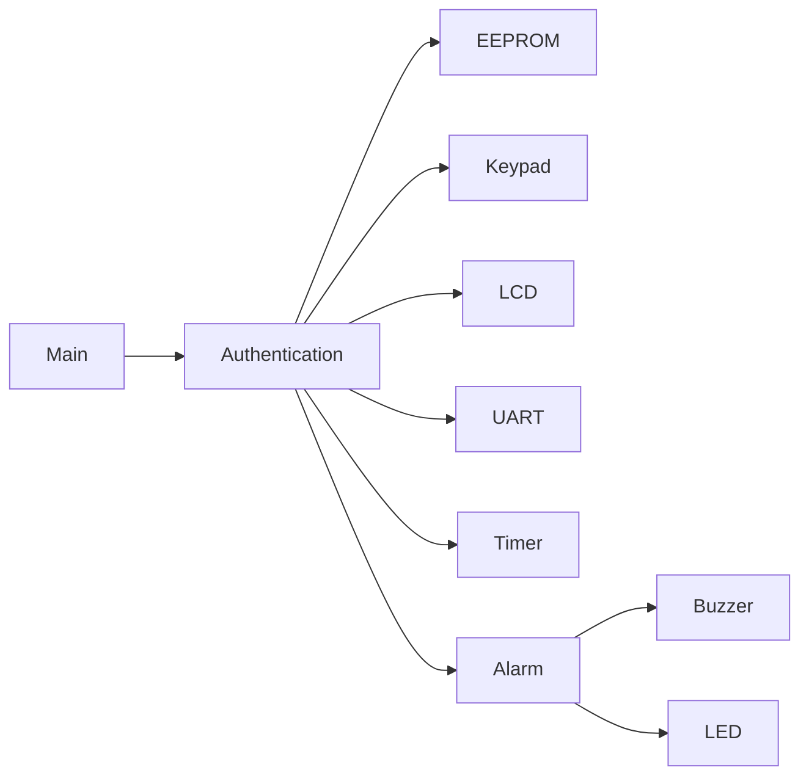

# 🔐 Access Control System
### Embedded Systems Final Project

An embedded access control system built on **ATmega32 AVR Microcontroller** that provides secure user authentication, access management, event monitoring, and alarm handling using layered embedded software architecture.

---

# 📌 Project Overview

The Access Control System is designed to provide a secure authentication mechanism using a password-based login system.

The system stores user credentials in EEPROM, allows authorized users to unlock the door, detects repeated failed attempts, activates an alarm when necessary, and communicates events over UART.

This project integrates most of the peripherals studied during the Embedded Systems course.

---

# 🎯 Project Objectives

- Authenticate users securely
- Manage multiple users
- Store passwords safely in EEPROM
- Detect unauthorized access
- Lock the system after multiple failed attempts
- Activate alarm during intrusion
- Display system status on LCD
- Receive user input from Keypad
- Report events through UART
- Build a modular embedded software architecture

---

# 📋 Functional Requirements

## Authentication

- User enters password using Keypad.
- Password is displayed as '*'.
- Password is compared with EEPROM stored password.
- Correct password grants access.
- Incorrect password increments failure counter.

---

## User Management

Administrator can:

- Add new user
- Delete user
- Change password
- Reset failed attempts
- Configure system settings

---

## Failed Attempt Detection

- Count every invalid password.
- Maximum allowed attempts = 3.
- After third attempt:
    - Door remains locked.
    - Alarm starts.
    - System enters LOCKOUT state.

---

## Lockout Mechanism

- Disable password entry.
- Timer counts lockout duration.
- Unlock automatically after timeout.

---

## Alarm Activation

Alarm activates when:

- Three consecutive wrong passwords.
- Security violation.

Alarm may be:

- Buzzer
- LED
- Both

---

## Event Reporting

Transmit through UART:

- Successful login
- Failed login
- Alarm activated
- User added
- User deleted
- Password changed

Example

```

LOGIN SUCCESS
LOGIN FAILED
SYSTEM LOCKED
ALARM ACTIVE

```

---

## Security States

The software follows a State Machine.

States:

- Idle
- Waiting Password
- Authentication
- Access Granted
- Access Denied
- Lockout
- Alarm
- Admin Menu

---

# 🛠 Hardware Requirements

- ATmega32
- 16x2 LCD
- 4x4 Keypad
- EEPROM (Internal or External I2C)
- Buzzer
- LEDs
- UART (CH340)
- Push Button (Optional)
- Power Supply

---

# 💻 Software Requirements

- Microchip Studio
- Proteus
- AVR-GCC
- Git
- GitHub

---

# 📚 Drivers Used

## MCAL

- DIO
- EXTI
- TIMER0
- ADC (optional)
- UART
- TWI (I2C)

---

## HAL

- LCD
- Keypad
- EEPROM
- Buzzer
- LEDs

---

## LIB

- STD_TYPES
- BIT_MATH
- Common Macros

---

# 📂 Project Structure

```

AccessControl/
│
├── APP
│      main.c
│      AccessControl.c
│
├── HAL
│      LCD
│      Keypad
│      EEPROM
│      Buzzer
│
├── MCAL
│      DIO
│      EXTI
│      TIMER
│      UART
│      TWI
│
├── LIB
│      STD_TYPES.h
│      BIT_MATH.h
│
└── README.md

```

---

# 🔄 System Flow



---

# 🧠 State Machine



---

# 🏗 Layered Architecture



---

# 📊 Module Diagram



---

# 📁 Password Storage

EEPROM stores:

| Address | Data |
|----------|------|
| 0x00 | User Count |
| 0x01 | Admin Password |
| 0x10 | User1 Password |
| 0x20 | User2 Password |
| ... | ... |

---

# 🔐 Security Features

- Password Authentication
- Hidden Password
- EEPROM Storage
- Failed Attempt Counter
- Lockout Timer
- Alarm System
- UART Logging
- Administrator Mode

---

# 🚀 Future Improvements

- RFID Authentication
- Fingerprint Sensor
- Bluetooth Control
- GSM Notifications
- Mobile Application
- SD Card Logging
- AES Password Encryption
- RTC Time Logging

---

# 📖 Course Information

Embedded Systems Diploma

Topics Covered

- Embedded C
- AVR Architecture
- DIO
- LCD
- Keypad
- Interrupts
- Timers
- PWM
- ADC
- UART
- SPI
- I2C
- EEPROM
- Layered Architecture
- Driver Development

---

# 👥 Team

| Name |
|------|
| Salma Waleed Mohamed |
| Yasmin Mohammed Abdel Fattah |
| Salma Mohamed Mahmoud |

---

# 👨‍💼 Team Leader

**Eng. Hesham Ahmed**

---

# 📜 License

This project was developed during the **NTI Embedded Systems Training Program**.

Licensed under the **MIT License**.

Project Organization: **Gestell**

---

# 🙏 Acknowledgment

Special thanks to

- National Telecommunication Institute (NTI)
- Eng. Hesham Ahmed
- Gestell Team

for their continuous support throughout the Embedded Systems training.

---

# ⭐ Thank You

Secure Embedded Systems Start with Good Software Architecture.